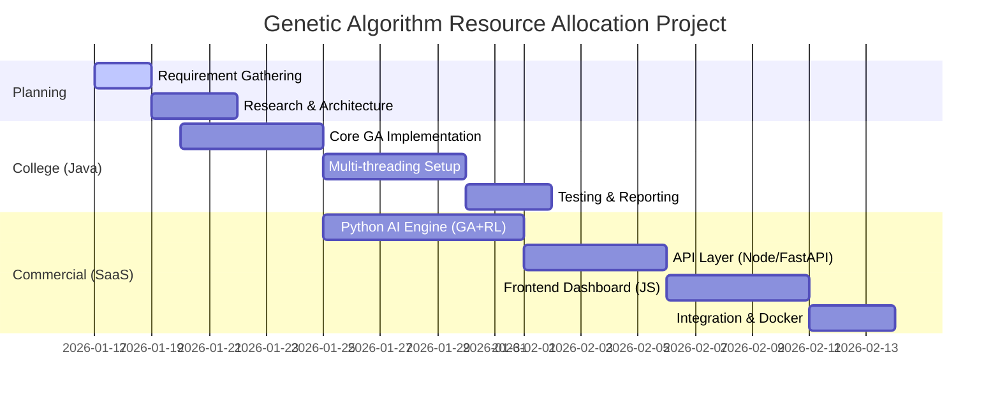

# Project Workflow & Architecture

## 🗓️ Development Timeline (Gantt Chart)



---

## 🔄 Data Flow Diagram (DFD) - Level 0

```text
   +-------------+        Request Resource       +-------------------+
   |  Cloud      | -------------------------->   |  SaaS API Gateway |
   |  Client     |                               |  (Node.js/Auth)   |
   +-------------+                               +-------------------+
          ^                                               |
          | Allocation Response                           | Forward Request
          | (JSON Plan)                                   v
          |                                      +-------------------+
          +------------------------------------- |  AI Engine (Py)   |
                                                 |  (GA + RL Model)  |
                                                 +-------------------+
```

---

## 🔄 Data Flow Diagram (DFD) - Level 1 (Inside AI Engine)

1.  **Input Parsing**: Receive JSON (VMs, Tasks, Constraints).
2.  **Population Init**: Create random allocation maps.
3.  **GA Loop**:
    *   **Fitness Calc**: Calculate Cost, Time, Energy.
    *   **Selection**: Pick best parents.
    *   **Crossover/Mutation**: Mix and modify.
4.  **Optimization**: Commercial version runs RL agent to fine-tune.
5.  **Output**: Best allocation map returned to API.
